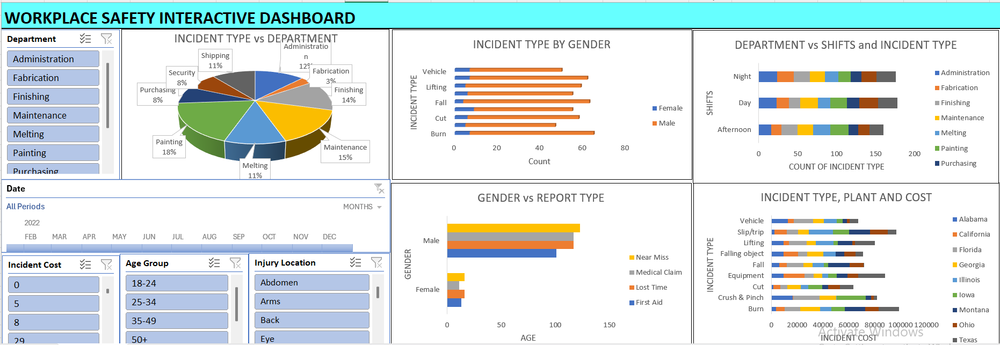

# Workplace-Safety-Insight
This Excel-based interactive dashboard tracks workplace safety incidents by department, location, and demographics. It helps HR and safety managers identify trends in injury types, frequency, and costs, offering insights to enhance safety strategies and reduce operational risk across the organization.

**Title:** [Workplace Safety Insight](https://github.com/Osiwi/github.io/blob/main/Workplace%20Safety%20Data%20Cleaned.xlsx)

**Tools & Technologies Used:** 
Microsoft Excel: Main platform for data visualization and interactive dashboard design.
Pivot Tables & Charts: Used for dynamic summaries of incident types, departments, shifts, genders, and costs.
Slicers & Timeline Filters: Enabled user-driven filtering by department, age group, injury location, incident cost, and date.
Pie, Bar & Stacked Charts: Provided clear comparative visuals across gender, location, and shifts.
Combo Charts: Used for multi-dimensional views like plant vs incident type vs cost.
Power Query (Get & Transform): Used to clean and integrate raw safety incident data for analysis.

**Project Description Overview:**
This Excel-based interactive dashboard tracks and visualizes workplace safety incidents across various departments, locations, and demographics. It supports safety managers and HR teams by uncovering trends in incident frequency, injury types, cost impact, and departmental exposure; providing insights to improve workplace safety strategies and reduce operational risks.

**Objective:**
To monitor, analyze, and report workplace safety incidents by type, shift, department, gender, location, and cost—enabling better safety compliance, risk mitigation, and employee health strategies.

**Key Features Included in the Dashboard:**
Incident Type vs Department: Pie chart categorizing incidents across operational units like Maintenance, Painting, and Finishing.
Incident Type by Gender: Side-by-side bar chart comparing incident frequency between male and female workers.
Department vs Shifts and Incident Type: Multi-level analysis of when and where incidents occur most frequently.
Gender vs Report Type: Breakdown of report classifications (e.g., Near Miss, Lost Time, Medical Claim) by gender.
Incident Type, Plant and Cost: Multi-category analysis linking incident types to geographic locations and their associated financial costs.
Interactive Filters: Filter by date, department, age group, injury location, and cost levels for focused insights.

**Key findings:**
Painting and Maintenance departments had the highest number of incidents, with Painting alone contributing 18%.
Burns and Cuts were the most frequent injury types, predominantly affecting male workers.
Incidents occurred most often during the Night and Day shifts, especially in high-risk departments like Fabrication and Melting.
Male employees experienced a higher rate of serious reports, including Lost Time and Medical Claims.
Slip/Trip and Burn incidents were the costliest, with certain plants like Texas and California showing high-cost concentration.
Workers aged 25–34 and 35–49 represented the most affected age groups, highlighting a critical target for safety interventions.
Summary:
This Workplace Safety Dashboard provides an actionable view of incident trends across locations, departments, and demographics. It empowers safety officers and managers with the insights needed to reduce injury rates, target safety training, and prioritize high-cost risk areas—ultimately contributing to a safer and more compliant workplace.

**Dashboard Overview:** 

